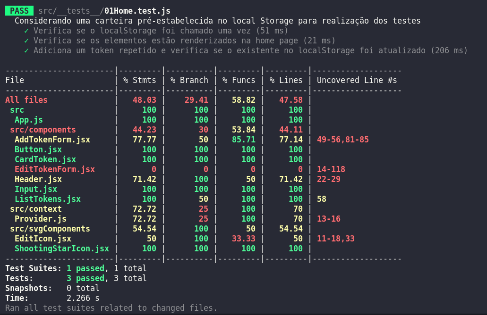
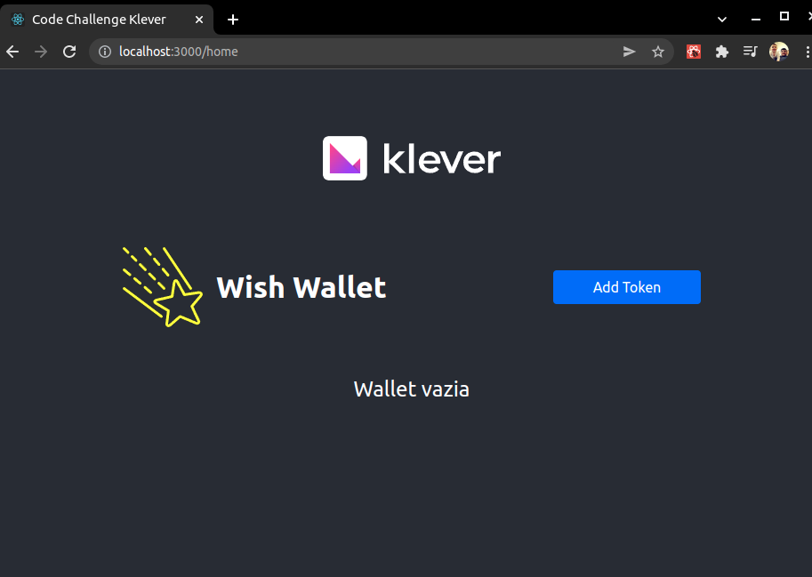
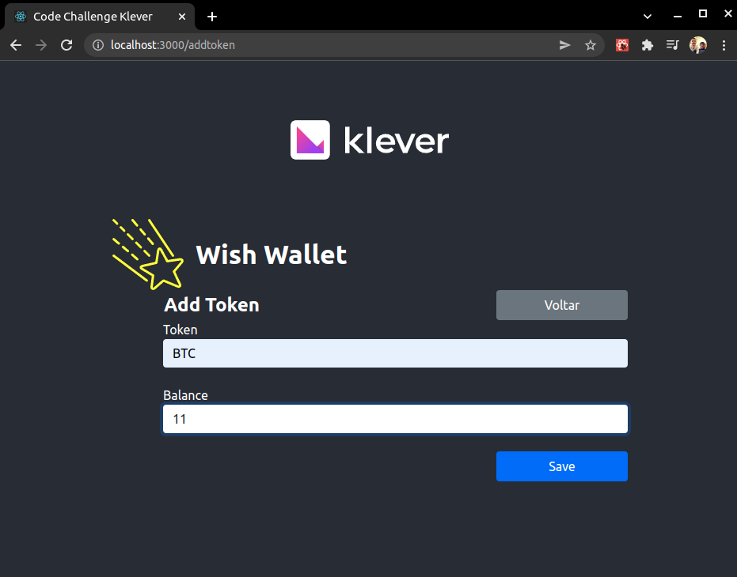
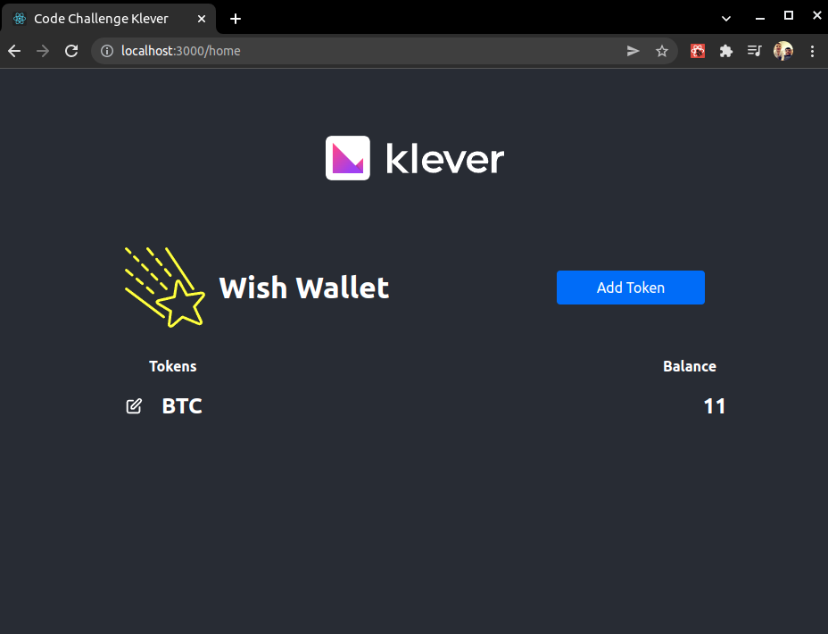
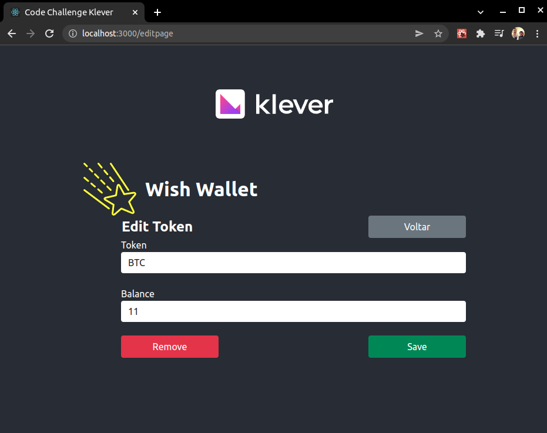

# Code Challenge - klever

Desafio Técnico associado a processo seletivo para front-end na Klever.

## Próximos passos

- Organizar a estilização (CSS) que fora realizada "inline" gerando arquivos próprios para cada componente;

- Aumentar a cobertura dos testes. Priorizei o desenvolvimento de alguns testes de integração na tentativa de explorar um caso de uso. A cobertura atual está em 48%.

## Instalação

Realize o clone numa pasta local ```git clone <url do repositório>```;

Execute ```npm install``` na pasta raiz do projeto e em seguida ```npm start```;


## Executando os testes

Para visualizar os testes, execute o seguinte comando dentro da pasta "front-end"

```bash
  npm run test
```
Para visualizar o relatório de cobertura dos testes:

```bash
  npm test -- --coverage
```

## Screenshots

</br>



</br>










## 🔗 Links
[](https://github.com/vitorgonzaga)
[](https://www.linkedin.com/in/vitorgonzaga/)


